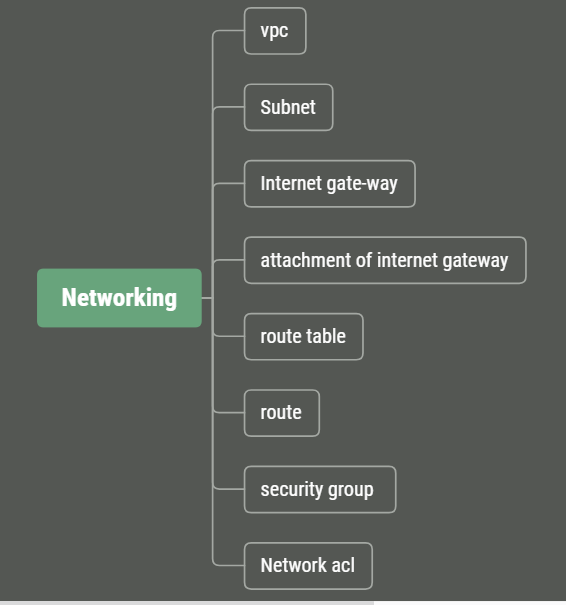
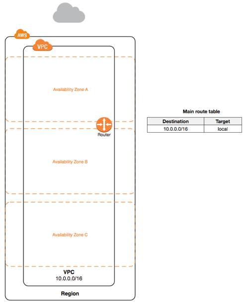
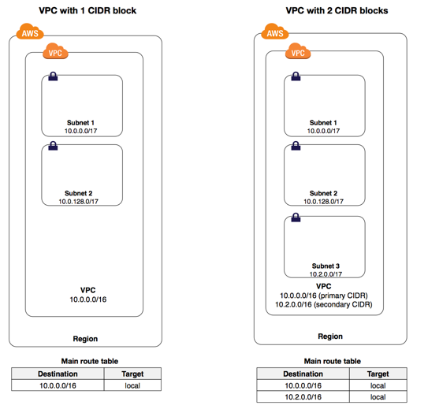
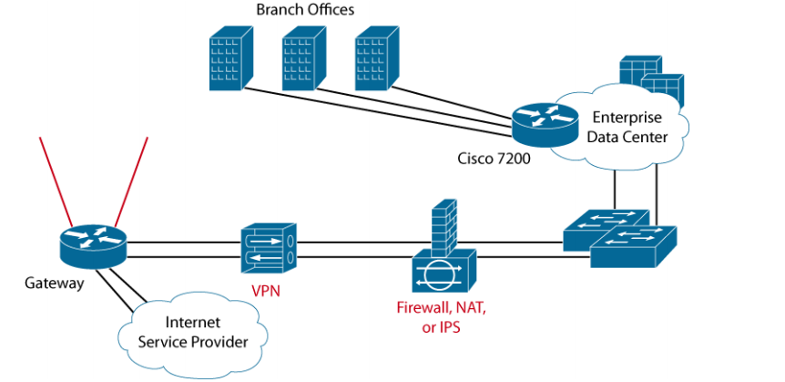
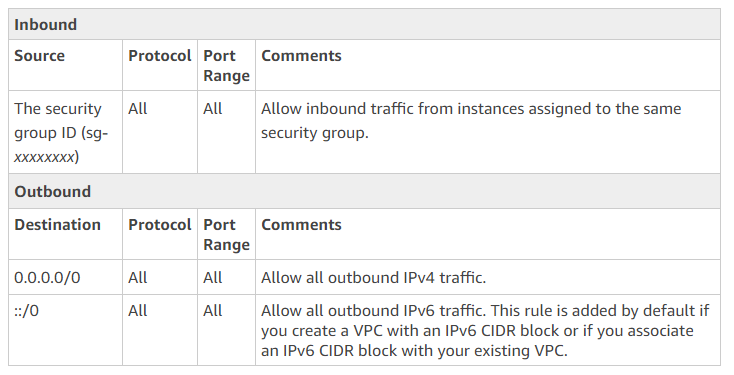
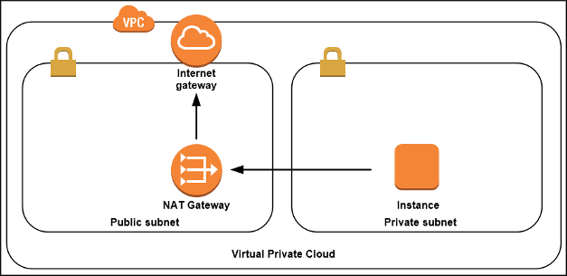
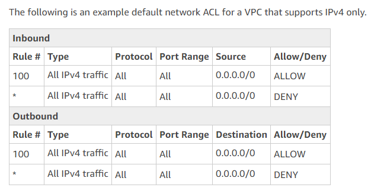

#  Networking In Aws

#  Vpc [ Virtual Private Cloud ] & Subnet
---
Create an Amazon VPC on AWS's scalable infrastructure and specify its private IP address range from any range you choose.

VPC and Subnet Basics. A virtual private cloud (VPC) is a virtual network dedicated to your AWS account. ... When you create a subnet, you specify the CIDR block for the subnet, which is a subset of the VPC CIDR block. Each subnet must reside entirely within one Availability Zone and cannot span zones.

# required for vpc in aws
  * Name of the vpc 
  * network ip for vpc (cidr-block :- 10.10.0.0/16) (Classless Inter-Domain Routing)

# subnet required 
  * Name of the subnet
  * select the vpc  (requried)
  * ip address (cidr-block :- 10.10.0.0/24) ,second subnet id (10.10.1.0/24), third subnet (10.10.2.0/24)
---
# Vpc peering
 
 
---
* Requests a VPC peering connection between two VPCs: a requester VPC that you own and an accepter VPC with which to create the connection. 
* The accepter VPC can belong to another AWS account and can be in a different Region to the requester VPC. The requester VPC and accepter VPC cannot have overlapping CIDR blocks.

# Pricing for a VPC Peering Connection
* If the VPCs in the VPC peering connection are within the same region, the charges for transferring data within the VPC peering connection are the same as the charges for transferring data across Availability Zones. 
* If the VPCs are in different regions, inter-region data transfer costs apply.
# Pending-acceptance: 
 * The VPC peering connection request is awaiting acceptance from the owner of the accepter VPC. During this state, the owner of the requester VPC can delete the request, and the owner of the accepter VPC can accept or reject the request. If no action is taken on the request, it expires after 7 days.
---
# Internet gateway & Attachment igw

---
Internet Gateways. An internet gateway is a horizontally scaled, redundant, and highly available VPC component that allows communication between instances in your VPC and the internet. It therefore imposes no availability risks or bandwidth constraints on your network traffic.

# Required for igw

  * Creates an internet gateway for use with a VPC. After creating the internet gateway, you attach it to a VPC using AttachInternetGateway .
  * Attaches an internet gateway to a VPC, enabling connectivity between the internet and the VPC. For more information about your VPC and internet gateway

---

# Route table & route & associate-route-table

---
* Creates a route table for the specified VPC
* After you create a route table, you can add routes and associate the table with a subnet.
* Associates a subnet with a route table. The subnet and route table must be in the same VPC
* This association causes traffic originating from the subnet to be routed according to the routes in the route table. The action returns an association ID, which you need in order to disassociate the route table from the subnet later
* A route table can be associated with multiple subnets.

---

# Security groups in aws 

Securitygroup :-

----
* AWS security groups (SGs) are associated with EC2 instances and provide security at the protocol and port access level. 
* Each security group –  working much the same way as a firewall – contains a set of rules that filter traffic coming into and out of an EC2 instance. 
* There are no ‘Deny’ rules. Rather, if there is no rule that explicitly permits a particular data packet, it will be dropped.

* A security group acts as a virtual firewall that controls the traffic for one or more instances. When you launch an instance, you can specify one or more security groups; otherwise, we use the default security group
*  A default security group includes a default rule that grants instances unrestricted network access to each other
*  When you create a security group, you specify a friendly name of your choice. You can have a security group for use in EC2-Classic with the same name as a security group for use in a VPC. However, you can't have two security groups for use in EC2-Classic with the same name or two security groups for use in a VPC with the same name

*  You can add or remove rules from your security groups using AuthorizeSecurityGroupIngress , AuthorizeSecurityGroupEgress , RevokeSecurityGroupIngress , and RevokeSecurityGroupEgress.

---
# NAT gateway  [ Network address translation ]

---
* NAT Gateways. You can use a network address translation (NAT) gateway to enable instances in a private subnet to connect to the internet or other AWS services, but prevent the internet from initiating a connection with those instances. ... You are charged for creating and using a NAT gateway in your account.
*NAT gateways are not supported for IPv6 traffic—use an egress-only internet gateway instead. For more information

# Creating a NAT Gateway

* To create a NAT gateway, you must specify a subnet and an Elastic IP address. Ensure that the Elastic IP address is currently not associated with an instance or a network interface. 
* If you are migrating from a NAT instance to a NAT gateway and you want to reuse the NAT instance's Elastic IP address, you must first disassociate the address from your NAT instance.

#  Elastic IP

*An Elastic IP address is a static IPv4 address designed for dynamic cloud computing. An Elastic IP address is associated with your AWS account. With an Elastic IP address, you can mask the failure of an instance or software by rapidly remapping the address to another instance in your account.

* An Elastic IP address is a public IPv4 address, which is reachable from the internet. If your instance does not have a public IPv4 address, you can associate an Elastic IP address with your instance to enable communication with the internet; for example, to connect to your instance from your local computer.

---

# NACL in aws [ Network access control list ]

---
* A network access control list (ACL) is an optional layer of security for your VPC that acts as a firewall for controlling traffic in and out of one or more subnets.
* You might set up network ACLs with rules similar to your security groups in order to add an additional layer of security to your VPC
  

  
* Creates an entry (a rule) in a network ACL with the specified rule number. Each network ACL has a set of numbered ingress rules and a separate set of numbered egress rules. When determining whether a packet should be allowed in or out of a subnet associated with the ACL, we process the entries in the ACL according to the rule numbers, in ascending order. Each network ACL has a set of ingress rules and a separate set of egress rules 
  
----

